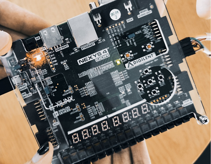
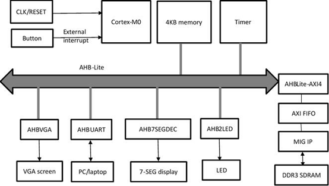
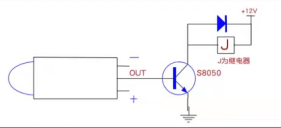
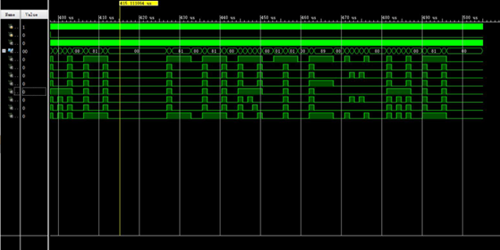
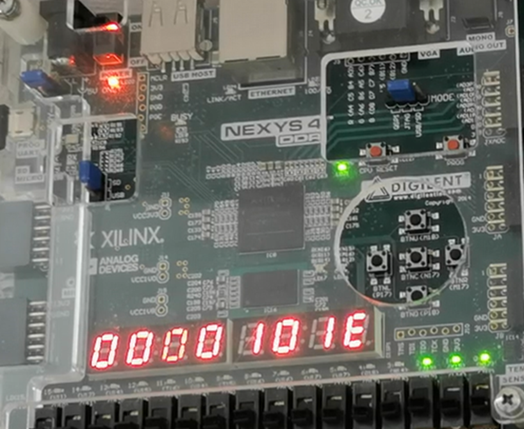

# Gesture Timing System Based on ARM Cortex-M0

This project is an entry for the 6th National College Student Integrated Circuit Innovation and Entrepreneurship Competition.

Team Members: Xiao Can, Wang Qinsi, Huang Bowen (Huazhong University of Science and Technology)

### Introduction

------

This system uses the ARM Cortex-M0 processor core and the SOC architecture independently designed on the FPGA platform to realize real-time monitoring of human hands using infrared sensors. The camera recognizes the numbers shown in the outline of the human hand and uses digital tubes and LED lights to time the functions based on their values. 

**Detailed project explanation video is [Project Video](https://drive.google.com/file/d/16GUCdx0pDTZht1QtMPr6UBPQMAKWzdlI/view?usp=drive_link).**

**Detailed code explanation video is [Code Video](https://drive.google.com/file/d/1A19bRf4T4UvOR5xOgypeSIKDf5zuv0H2/view?usp=drive_link).**

### Architecture Design

------

## 

The overall structure of the system is shown in the figure.

- The system employs ARM's Cortex-M0 soft core IP as the central processing unit, deployed entirely on an FPGA platform.
- The Cortex-M0 processor communicates with other components via the AMBA™3 AHB-Lite interface, interrupt and event inputs, three state outputs, and one event output.
- The BusMatrix manages data exchange between AHB, DMA, SRAM, and MIF. The AHB‐Lite bus is responsible for instruction fetching and data access operations. 
- Compiled executables are converted into Verilog HDL memory model-oriented hex format files using the tool, then initialized into the hardware code.
- The SRAM area primarily provides memory space for software code execution, such as allocating space for heap and stack. 

## Module Settings

------

####  1、APB

The APB peripherals of this system are equipped with several modules such as LED lights, UART, infrared sensors, and timers. They are mounted to the system through the APB bus and are responsible for realizing the auxiliary functions of the system.

#### 2、LED

There are 8 LED lights on the development board, which light up at high level. The physical address of the LED is 0x50000000. The software code writes a 64-bit unsigned integer data to this address to control the lighting status of 8 LEDs. The LED status shows the current count and is expressed in binary.

#### 3、UART

The software code can output detailed information such as specific human hand position coordinates and hand size in the image through UART, so that you can view more detailed detection results or monitor the operating status of the system.

#### 4、Infrared sensor

The infrared sensor uses HC-SR501 RD-624 human body infrared module. Its sensing distance is within 1m. According to our actual measurement, the sensing distance is about 0.8m. Its low level is effective. When it senses that a human body is approaching, it sends an effective signal, and the processor accepts and turns on the camera.

#### 5、Camera

After successfully writing a frame of image data, the camera module will send an interrupt request to the Cortex-M0 processor to wake up the Cortex-M0 processor from standby state. The software code will begin to execute the image processing control process and cooperate with the hardware accelerator detection Human hand information in images. After obtaining the detection results, the Cortex-M0 processor sends a request to the camera module to collect new images, and at the same time enters the standby state, waiting for the arrival of the next frame of images, and so on.

## Simulation

In this design, the Master host uses ARM Cortex-m0, which is responsible for transmitting control signals, address signals, and processing the data read by the multiplexer from the Slave device; the global signals are implemented using PLL. The decoder decoder decodes the address transmitted by ARM Cortex-m0, and then selects the GPIO module to be displayed as an LED in this example. Through behavioral-level simulation, we can see CORTEXm0 and print it on the timing.

## Function

#### 1、Timing

When the external interrupt is generated and the system starts, you can see that the digital tube starts timing (for convenience, hexadecimal timing is used in the test). At the same time, you can see that the number of external interrupts, that is, the number of times a human hand approaches, is displayed below the digital tube.

#### 2、Sensing

More test results are [Test Video](https://drive.google.com/file/d/1wlCpAaPzykMx-FlT8bcayOSx0C8S-mW5/view?usp=drive_link) and [Result Video](https://drive.google.com/file/d/13OnZZPTVwbxww2JnaXxhdYNfJk_T4u9w/view?usp=drive_link).

